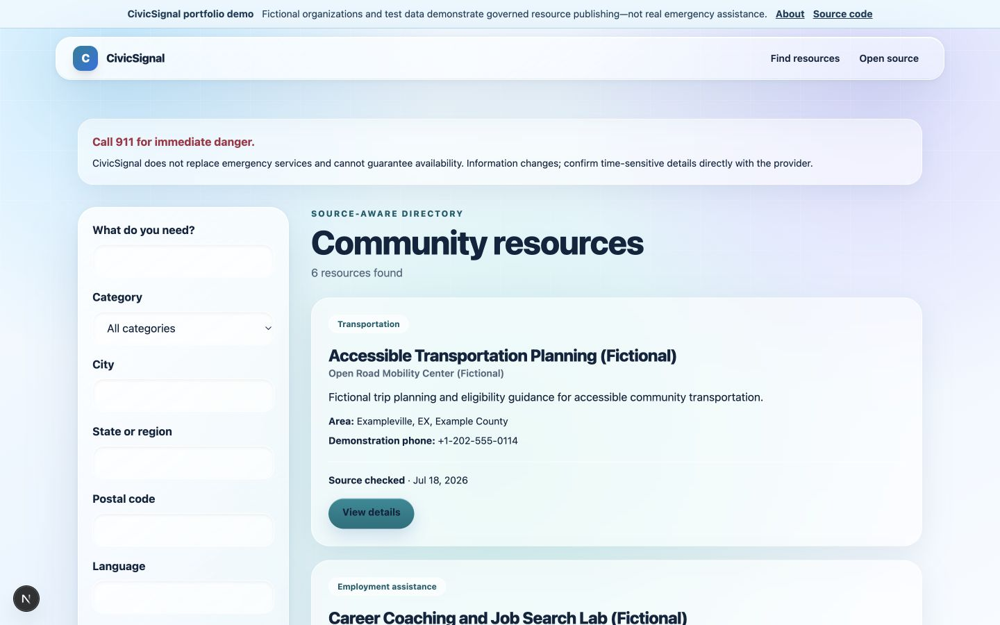
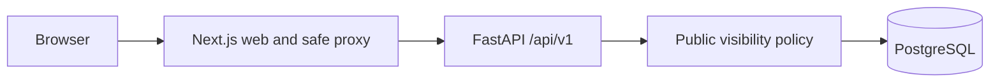
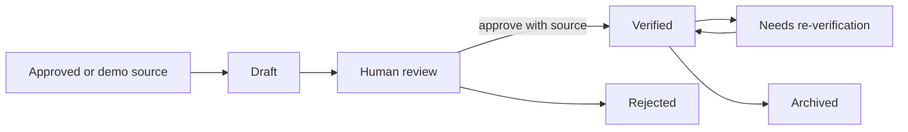
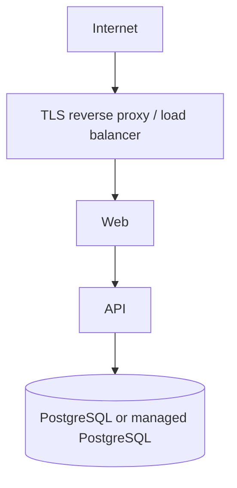

# CivicSignal

CivicSignal addresses a deceptively hard public-interest problem: people need clear community-resource information, while service hours, eligibility, accessibility, and availability can change quickly. The project now provides a deterministic, source-aware directory—not an AI recommendation engine—and makes uncertainty visible.



**Status:** portfolio-stage release candidate using curated fictional data. It demonstrates
professional full-stack engineering; it is not a production emergency directory or a claim of
real-world service coverage.

> CivicSignal does not replace emergency services or guarantee availability. The default US configuration says: **Call 911 for immediate danger.** Self-hosters must configure messaging for their jurisdiction.

## Why it matters

Community directories become stale, yet directly applying unverified public edits can cause harm.
CivicSignal treats corrections as governed work: triage leads to re-verification, a sourced immutable
proposal, human evidence, transactional publication, and an audit trail. The public sees provenance
and freshness without being exposed to internal workflow details.

## Current capabilities

| Capability                                         | Hosted edition             | Self-hosted community edition |
| -------------------------------------------------- | -------------------------- | ----------------------------- |
| Public browsing and deterministic search           | Supported by same codebase | Supported                     |
| Source references and verification dates           | Supported                  | Supported                     |
| Docker Compose and PostgreSQL                      | Deployment choice          | Supported                     |
| Branding and emergency message                     | Environment configuration  | Environment configuration     |
| Fictional demonstration seed                       | Optional                   | Optional                      |
| Secure administrator access and account management | Included                   | Included                      |
| Corrections, revisions, verification, and audit    | Included                   | Included                      |
| AI, scraping, live availability                    | Not implemented            | Not implemented               |

Public results require an active organization and service, at least one source, and a latest verification state of `verified` or `needs_reverification`. Draft, rejected, archived, inactive, and sourceless records are excluded. A stale label is not a confidence score and verification does not promise availability.

## Quick demo

Requirements: Docker with Compose v2.

This configured checkout uses web port `3001` and API port `8001`. **Do not replace the local
`.env` with `.env.example` after configuration.** The local file is ignored by Git.

```bash
cd CivicSignal
docker compose up --build -d
```

Open <http://localhost:3001/resources>; API documentation is at <http://localhost:8001/docs>. The demo is fictional and uses reserved `.example` domains.

```bash
curl 'http://localhost:8001/api/v1/services?category=food-assistance&city=Exampleville'
```

Stop with `docker compose down`. Reset deliberately with `docker compose down -v`. See [development](docs/development.md), [self-hosting](docs/deployment/self-hosting.md), and [architecture](docs/architecture.md).

## Key engineering features

- Governed correction-to-publication workflow with immutable numbered revisions.
- Separate working and published pointers plus optimistic-concurrency conflict handling.
- HTTP-only opaque sessions, Argon2 passwords, CSRF protection, RBAC, and revocation.
- Transactional verified publication, provenance, freshness calculation, and structured audit events.
- Deterministic stale detection with advisory locking and duplicate active-task prevention.
- Responsive semantic public/admin interfaces and keyboard-tested accessible dialogs.
- FastAPI, Next.js, PostgreSQL, Alembic, Docker Compose, Render, and security-focused CI.

### Direct local administrator quick start

Docker is optional for the application processes. Start PostgreSQL locally, set `DATABASE_URL`,
then run:

```bash
cd apps/api
python -m venv .venv
.venv/bin/pip install -e '.[dev]'
.venv/bin/alembic upgrade head
.venv/bin/civicsignal admin create --email admin@example.test --display-name "Local admin"
.venv/bin/uvicorn civicsignal_api.main:app --reload
```

In another terminal:

```bash
cd apps/web
npm ci
API_INTERNAL_URL=http://localhost:8000 npm run dev
```

Open the public directory at <http://localhost:3000/resources> and administrator sign-in at
<http://localhost:3000/admin/sign-in>. Sign out from the administrator header. Run backend checks
with `cd apps/api && .venv/bin/pytest` and frontend checks with `cd apps/web && npm test`.

Run the freshness job safely with `docker compose exec api civicsignal resources detect-stale
--dry-run`; remove `--dry-run` to create idempotent re-verification work. CivicSignal is not a public
beta or v1.0. The current release blockers are tracked in
[`docs/release/beta-checklist.md`](docs/release/beta-checklist.md).

## Architecture







The API uses FastAPI, Pydantic Settings, async SQLAlchemy, Alembic, and PostgreSQL. The web uses Next.js, strict TypeScript, React, and Tailwind. The PWA shell caches only an offline warning and icon; it never caches resource API responses. See the [ADRs](docs/adr/README.md) for decisions and tradeoffs.

## Quality, security, and privacy

CI runs formatting, linting, types, tests, migrations, builds, dependency review, secret scanning, and static analysis. Automated checks support—but do not replace—manual accessibility, privacy, and security review. Searches are not persisted or logged in full by application code, precise user location is not collected, and no advertising or user profiling exists. See [privacy design](docs/privacy-design.md), [threat model](docs/threat-model.md), and [security policy](SECURITY.md).

## Testing

```bash
cd apps/api
.venv/bin/ruff format --check .
.venv/bin/ruff check .
.venv/bin/mypy src tests
.venv/bin/pytest

cd ../web
npm run format
npm run lint
npm run typecheck
npm test
npm run build
PLAYWRIGHT_BASE_URL=http://localhost:3001 npm run test:e2e
```

See the [portfolio case study](docs/portfolio/case-study.md),
[architecture overview](docs/portfolio/architecture-overview.md), and
[demonstration script](docs/portfolio/demo-script.md).

## AI-assisted development

Coding tools may assist, but contributors must disclose material use and remain responsible for understanding, testing, licensing, and securing their work. Fabricated citations, tests, sources, or command results are prohibited. See [AI development policy](docs/ai-development-policy.md).

## Project status and roadmap

This is a pre-1.0 portfolio release candidate—not a production-readiness, security, compliance, or accuracy claim. Known limitations include fictional-only seed data, basic database search, process-local public-write rate limiting, and no production operations program. The [roadmap](ROADMAP.md) keeps optional platform expansion separate from the portfolio finish line.

Contributions are welcome under the Apache License 2.0; read [CONTRIBUTING.md](CONTRIBUTING.md), [GOVERNANCE.md](GOVERNANCE.md), and the [Code of Conduct](CODE_OF_CONDUCT.md).

## Author

Designed and built by **Robert McDermott**. Portfolio, GitHub profile, and LinkedIn links can be
added when their preferred public URLs are configured; this repository does not invent or publish
private contact information.
