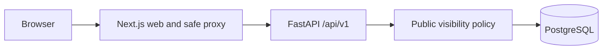
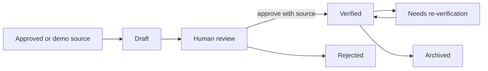
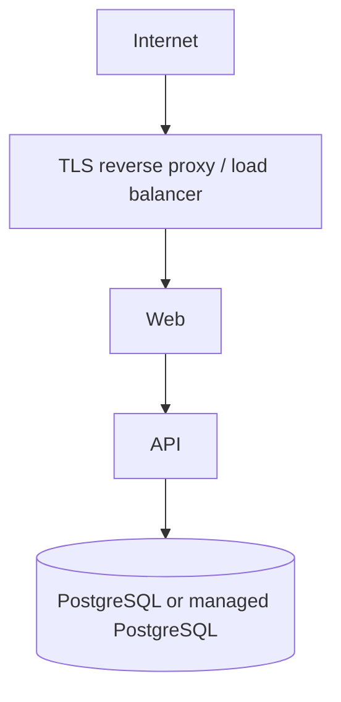

# CivicSignal

CivicSignal addresses a deceptively hard public-interest problem: people need clear community-resource information, while service hours, eligibility, accessibility, and availability can change quickly. The project now provides a deterministic, source-aware directory—not an AI recommendation engine—and makes uncertainty visible.

> CivicSignal does not replace emergency services or guarantee availability. The default US configuration says: **Call 911 for immediate danger.** Self-hosters must configure messaging for their jurisdiction.

## Current capabilities

| Capability | Hosted edition | Self-hosted community edition |
| --- | --- | --- |
| Public browsing and deterministic search | Supported by same codebase | Supported |
| Source references and verification dates | Supported | Supported |
| Docker Compose and PostgreSQL | Deployment choice | Supported |
| Branding and emergency message | Environment configuration | Environment configuration |
| Fictional demonstration seed | Optional | Optional |
| Secure administrator access and account management | Included | Included |
| Resource governance, AI, scraping, live availability | Not implemented | Not implemented |

Public results require an active organization and service, at least one source, and a latest verification state of `verified` or `needs_reverification`. Draft, rejected, archived, inactive, and sourceless records are excluded. A stale label is not a confidence score and verification does not promise availability.

## Quick demo

Requirements: Docker with Compose v2.

```bash
cp .env.example .env
docker compose up --build -d
docker compose exec api civicsignal-seed
```

Open <http://localhost:3000/resources>; API documentation is at <http://localhost:8000/docs>. The demo is fictional and uses reserved `.example` domains.

```bash
curl 'http://localhost:8000/api/v1/services?category=food-assistance&city=Exampleville'
```

Stop with `docker compose down`. Reset deliberately with `docker compose down -v`. See [development](docs/development.md), [self-hosting](docs/deployment/self-hosting.md), and [architecture](docs/architecture.md).

### Direct local administrator quick start

Docker is optional for the application processes. Start PostgreSQL locally, set `DATABASE_URL`,
then run:

```bash
cd apps/api
python -m venv .venv
.venv/bin/pip install -e '.[dev]'
.venv/bin/alembic upgrade head
.venv/bin/civicsignal admin create --email admin@example.test --display-name "Local admin"
.venv/bin/uvicorn civicsignal_api.main:app --reload
```

In another terminal:

```bash
cd apps/web
npm ci
API_INTERNAL_URL=http://localhost:8000 npm run dev
```

Open the public directory at <http://localhost:3000/resources> and administrator sign-in at
<http://localhost:3000/admin/sign-in>. Sign out from the administrator header. Run backend checks
with `cd apps/api && .venv/bin/pytest` and frontend checks with `cd apps/web && npm test`.

Run the freshness job safely with `docker compose exec api civicsignal resources detect-stale
--dry-run`; remove `--dry-run` to create idempotent re-verification work. CivicSignal is not a public
beta or v1.0. The current release blockers are tracked in
[`docs/release/beta-checklist.md`](docs/release/beta-checklist.md).

## Architecture







The API uses FastAPI, Pydantic Settings, async SQLAlchemy, Alembic, and PostgreSQL. The web uses Next.js, strict TypeScript, React, and Tailwind. The PWA shell caches only an offline warning and icon; it never caches resource API responses. See the [ADRs](docs/adr/README.md) for decisions and tradeoffs.

## Quality, security, and privacy

CI runs formatting, linting, types, tests, migrations, builds, dependency review, secret scanning, and static analysis. Automated checks support—but do not replace—manual accessibility, privacy, and security review. Searches are not persisted or logged in full by application code, precise user location is not collected, and no advertising or user profiling exists. See [privacy design](docs/privacy-design.md), [threat model](docs/threat-model.md), and [security policy](SECURITY.md).

## AI-assisted development

Coding tools may assist, but contributors must disclose material use and remain responsible for understanding, testing, licensing, and securing their work. Fabricated citations, tests, sources, or command results are prohibited. See [AI development policy](docs/ai-development-policy.md).

## Project status and roadmap

This is `v0.1.0-alpha` preparation—not a production-readiness, security, compliance, or accuracy claim. Screenshots are intentionally deferred until the Docker demo is visually reviewed. Known limitations include fictional-only seed data, no secure admin interface, basic database search, process-local metrics, and no production rate limiter. The [roadmap](ROADMAP.md) covers the next milestone: secure administration, controlled ingestion, re-verification workflows, and stale-information automation.

Contributions are welcome under the Apache License 2.0; read [CONTRIBUTING.md](CONTRIBUTING.md), [GOVERNANCE.md](GOVERNANCE.md), and the [Code of Conduct](CODE_OF_CONDUCT.md).
