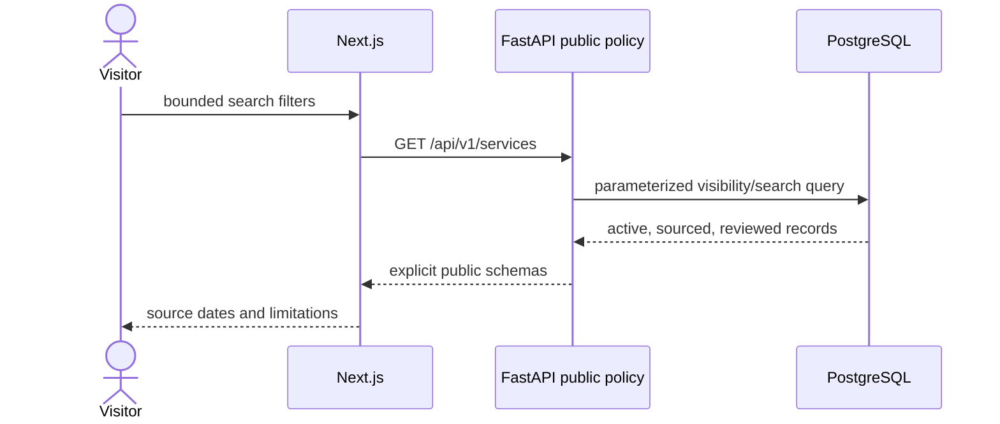

# Architecture

CivicSignal uses one configuration-driven codebase for hosted and self-hosted deployments. Next.js provides semantic public pages and a narrow same-origin proxy. FastAPI owns versioned read schemas and deterministic search. PostgreSQL owns resource integrity; Alembic owns schema evolution.

## Data flow and trust boundaries

Browsers, future imports, environment values, and source content are untrusted. PostgreSQL is private. Query strings are processed but deliberately excluded from application logs. Browser code never receives reviewer notes, reviewer identity, database objects, secrets, or unpublished records.

## Resource model

Organizations own services and locations. Services relate to controlled categories, structured contact channels, locations, sources, and verification events. Foreign keys restrict deletion of provenance and verification history; records are deactivated or archived. Location coordinates are bounded. Likely name, region, source-date, and status paths are indexed.

The latest verification event controls public state. `verified` is current according to the recorded review, while `needs_reverification` is public with a warning. Public records must also be active and sourced. This is not a guarantee of availability.

Administrative creation and transition logic exists only as an internal service boundary. There are no public write routes and no deliberately weak authentication substitute.

## Operations

Liveness tests the API process; readiness executes `SELECT 1`. JSON logs include method, path, status, duration, and correlation ID without query strings. Process-local counters are available for integration but are not a durable metrics backend. CORS, body limits, timeouts, log level, and emergency text are configured by environment. Distributed rate limiting, production CSP, authentication, and external metrics/error backends remain deployment or next-milestone work.

The service worker caches only an offline warning and icon, never resource API data. See ADRs and deployment documents for alternatives and consequences.
