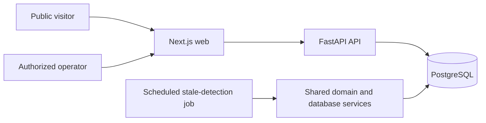
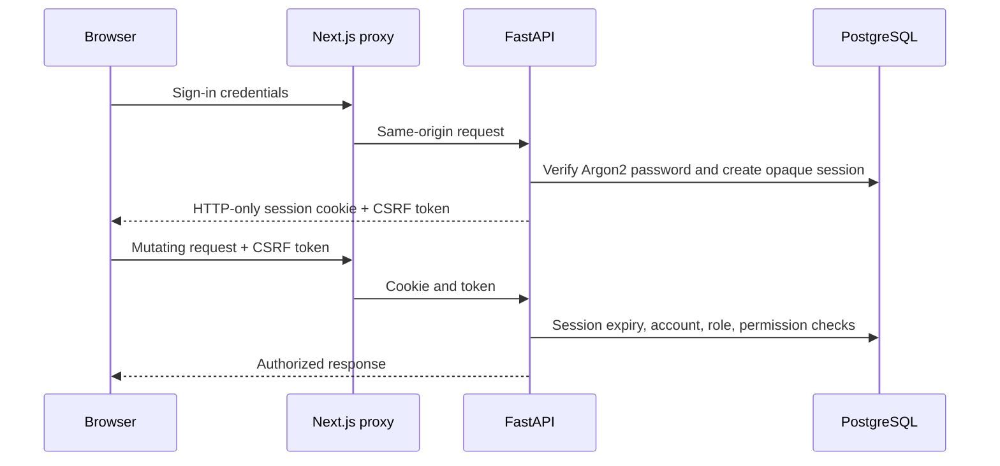
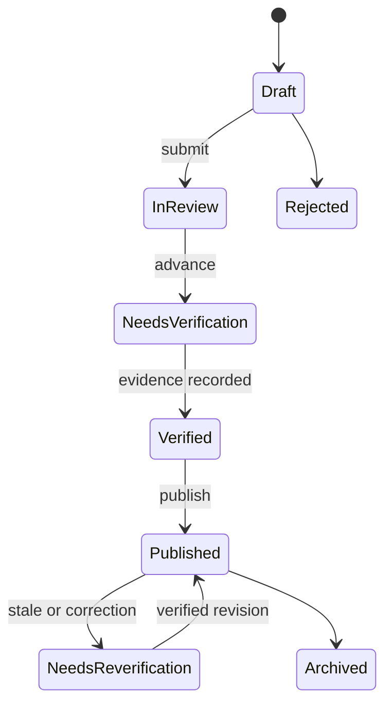
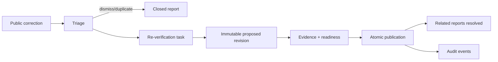
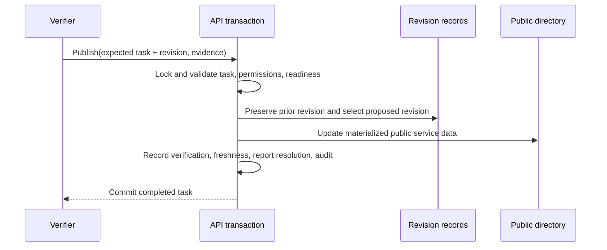
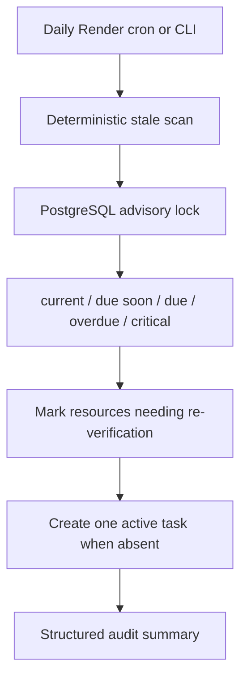

# Architecture overview

## System context

The web layer renders the public directory and administrator UI, and exposes same-origin proxy
routes. The API owns validation, authorization, workflow state, and publication decisions.
PostgreSQL stores public directory data, governance revisions, accounts, sessions, work queues,
corrections, verifications, and audit events. Alembic owns schema evolution.

## Authentication and authorization

Contributor, reviewer, verifier, and administrator roles map to explicit permissions. Sensitive
routes enforce permissions at the API boundary; UI visibility is convenience rather than authority.

## Resource lifecycle

Governed resources use numbered immutable `ResourceRevision` records. `current_revision_id` points
to the working revision; `published_revision_id` remains stable until verified publication.

## Correction lifecycle

Reporter contact is optional and permission-restricted. Duplicate intake is mitigated without
revealing whether another person submitted the same report.

## Publication transaction

Any exception before commit prevents partial publication.

## Freshness and scheduled work

The CLI supports a dry run and deterministic timestamp. Repeated execution does not create duplicate
active work.

## Deployment and testing

Docker Compose runs PostgreSQL, the API, and web application locally. Render describes PostgreSQL,
private API, public web, health checks, TLS at the platform edge, secure staging cookies, a scheduled
job, and noindex behavior. CI runs Python formatting/Ruff/MyPy/pytest, frontend formatting/ESLint/
TypeScript/Vitest/build, Compose builds, migration-backed E2E, dependency review, secret scanning,
and CodeQL.
